# NoonLabs

Learn fundamentals. Build modern AI.

From mathematical foundations to modern AI systems.

<!--
SLIDE 1 - Brand stamp
On screen ~4 seconds. Say "Bienvenue sur NoonLabs" over it and move on.
-->

---
layout: section
class: nl-deck
---

Chapter 14

# Data Visualization

The January expenses again, as charts you can read at a glance

  <NlIcon name="cells" /> Matplotlib
  ·
  <NlIcon name="layers" /> Seaborn
  ·
  <NlIcon name="play" /> Plotly

<!--
SLIDE 2 - Chapter divider
On screen ~8 seconds.

Pay off the promise from the end of chapter thirteen:
"Chapitre quatorze. Au chapitre treize, je vous ai promis ces mêmes dépenses,
en graphiques. Les voici. Trois bibliothèques : matplotlib, la base ; seaborn,
pour les statistiques ; et Plotly, pour l'interactif."

Restate the format so nobody wonders:
"Les diapositives, c'est pour les concepts. Le code, on l'écrit ensemble
dans VS Code."
-->

---
layout: default
class: nl-deck
---

# Figure, Axes & Artists

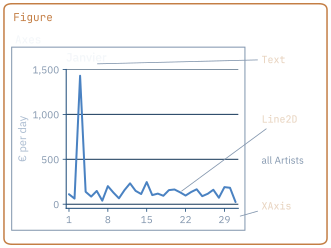

<NlIcon name="layers" /> Three levels

  
Figure

the whole image: size, dpi, saving

  
Axes

one plot: its axes, ticks, title

  
Artist

anything drawn: a line, a text

`plt.subplots()` returns the first two: `fig` and `ax`. Then draw with `ax.`,
not `plt.`: you name the Axes you mean.

A Figure holds Axes, an Axes holds Artists — and you draw on the Axes

 Live in VS Code

<!--
SLIDE 3 - Figure, Axes, Artist. This is the chapter's PLANT.
On screen ~65 seconds.

Point at the figure first, outside in:
"Le cadre bronze, c'est la Figure : l'image entière. Le cadre gris, c'est un
Axes : un graphique, avec ses axes, ses graduations, son titre. Et dedans,
tout ce qui est dessiné - la ligne, le titre, l'axe des x - ce sont des
Artists."

Then type it live in VS Code:
fig, ax = plt.subplots()
type(ax)            ->  <class 'matplotlib.axes._axes.Axes'>
ax.figure is fig    ->  True
ax.plot([1, 2, 3])  ->  [<matplotlib.lines.Line2D object at 0x...>]
ax.set_title("Janvier")

"ax.plot renvoie une liste avec un Line2D. Une ligne, c'est un objet. Le
titre, c'est un objet. Matplotlib appelle ça des Artists."

PAUSE.

The vocabulary trap, said once: Axes, avec un s, c'est un graphique. Axis,
sans s, c'est un seul axe, x ou y.

PLANT the payoff and do not explain it:
"Retenez une chose : tout ce qu'on dessine finit sur un Axes. Même quand ce
n'est pas vous qui l'avez dessiné."

[CLICK]
"Une Figure contient des Axes, un Axes contient des Artists. Et c'est sur
l'Axes qu'on dessine."
-->

---
layout: default
class: nl-deck
---

# Line & Scatter Plots

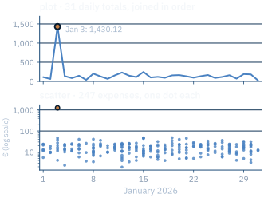

<NlIcon name="arrow" /> A line connects

`plot` joins the points in order. Use it when the order means something:
days, epochs, steps. One spike: January 3.

<NlIcon name="split" /> A scatter does not

`scatter` draws each expense alone: 247 dots, on a log scale so the rent does
not flatten the rest.

<ul class="mt-2" style="font-size: 1.05rem">
<li class="nl-bad">A line through categories invents a trend</li>
</ul>

A line says the points follow each other — use it only when they do

<!--
SLIDE 4 - Line and scatter
On screen ~55 seconds. Concept slide, no live coding needed.

Callback to chapter thirteen, resample:
"Le resample du chapitre treize : la somme par jour. Trente et un jours,
trente et un points. plot les relie dans l'ordre."

Point at the spike:
"Un pic, le trois janvier : mille quatre cent trente euros. On saura bientôt
pourquoi - on va l'écrire sur le graphique."

PAUSE.

Point at the bottom chart:
"scatter, lui, ne relie rien. Deux cent quarante-sept dépenses, deux cent
quarante-sept points. Chacun est seul. Et le point bronze, tout en haut,
c'est la dépense du pic."

[CLICK]
"Une ligne dit que les points se suivent. Utilisez-la seulement quand c'est
vrai."
-->

---
layout: default
class: nl-deck
---

# Bar Charts & Histograms

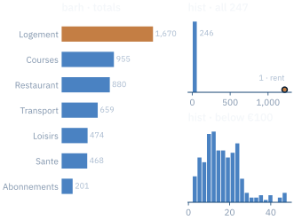

<NlIcon name="layers" /> Two different questions

A bar compares **categories**. A histogram counts the values of **one
column** per interval.

<NlIcon name="cross" /> One value, one axis

The rent, 1250, stretches the axis: 246 expenses share the first bar. Below
€100, the shape appears.

A bar compares categories; a histogram shows a column's spread

 Live in VS Code

<!--
SLIDE 5 - Bar and histogram
On screen ~60 seconds.

Callback to chapter thirteen, the groupby slide:
"Les totaux par catégorie du chapitre treize. Logement en haut, Abonnements en
bas. barh, avec un h : des barres horizontales, pour que les noms de catégories
restent lisibles."

Then run the histogram live, on every expense:
ax.hist(df["montant"], bins=20)
"Vingt barres. La première contient deux cent quarante-six dépenses. La
dernière, une seule. Et entre les deux... rien."

PAUSE.

"Cette dépense seule à droite, c'est le loyer. Mille deux cent cinquante
euros. Il étire l'axe, et tout le reste s'écrase dans une seule barre."

Run it again on the expenses below a hundred euros:
ax.hist(df.loc[df["montant"] < 100, "montant"], bins=20)
The 246 values spread out, most of them between five and fifty euros, and the
shape finally appears.

[CLICK]
"Une barre compare des catégories. Un histogramme montre comment une colonne
se répartit."
-->

---
layout: default
class: nl-deck
---

# Pie Charts & Boxplots

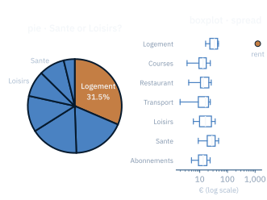

<NlIcon name="split" /> Pie: parts of one whole

Seven slices. Sante is 8.8 %, Loisirs 8.9 %: the angles cannot tell you which
is bigger. A sorted bar chart can.

<NlIcon name="layers" /> Boxplot: the spread per group

<ul class="mt-2" style="font-size: 1.05rem">
<li class="nl-good">Median, quartiles, and each outlier as a dot: one, the rent</li>
<li class="nl-bad"><code>labels=</code> raises a <code>TypeError</code> in 3.11: <code>tick_labels=</code></li>
</ul>

A pie shows shares; a boxplot shows the spread and the outliers

<!--
SLIDE 6 - Pie and boxplot
On screen ~55 seconds. Concept slide, no live coding needed.

The pie first, honestly. Point at the two labelled slices:
"Le camembert dit une chose : le logement, c'est trente et un virgule cinq
pour cent du mois. Mais Santé ou Loisirs, lequel est le plus gros ? À l'œil,
impossible. Huit virgule huit contre huit virgule neuf. Au-delà de trois ou
quatre parts, une barre triée se lit mieux."

PAUSE.

"La boîte à moustaches, elle, montre la répartition de chaque catégorie : la
médiane, les quartiles du describe du chapitre treize. Et tout ce qui sort des
moustaches est dessiné à part. Un seul point, ici : le loyer."

Time-sensitive: depuis matplotlib 3.11, l'argument labels de boxplot n'existe
plus. Il s'appelle tick_labels. Un tutoriel qui écrit labels lève une
TypeError.

[CLICK]
"Un camembert montre des parts. Une boîte à moustaches montre la répartition,
et isole les valeurs aberrantes."
-->

---
layout: default
class: nl-deck
---

# Subplots

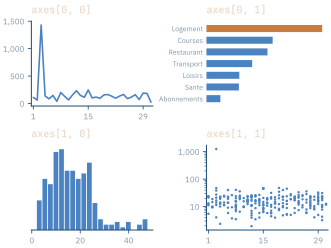

<NlIcon name="cells" /> An array of Axes

`plt.subplots(2, 2)` returns a NumPy array of Axes, shape `(2, 2)`, indexed as
in chapter 12. `subplots(1, 3)` gives a flat one, `(3,)`.
`layout="constrained"` keeps the titles apart.

<ul class="mt-3" style="font-size: 1.05rem">
<li class="nl-good"><code>axes[0, 1].set_title(...)</code> — you name the Axes</li>
<li class="nl-bad"><code>plt.title(...)</code> — it titles only the last one</li>
</ul>

<code>subplots</code> returns a grid of Axes — index it like an array

<!--
SLIDE 7 - Subplots
On screen ~55 seconds. Concept slide, no live coding needed.

"Deux lignes, deux colonnes : quatre graphiques dans une seule Figure. Et axes
n'est pas une liste. C'est un tableau NumPy, de forme deux, deux."

Callback to chapter twelve, pointing at the titles on the figure:
"axes crochet zéro, un : la ligne zéro, la colonne un. Les barres. L'indexation
du chapitre douze, appliquée à des graphiques."

PAUSE.

The trap, because the plt interface hides it:
"Si vous écrivez plt.title, matplotlib choisit l'Axes courant. C'est le
dernier créé. Vos trois autres graphiques n'ont pas de titre. Avec ax, vous
dites lequel."

constrained in one sentence: matplotlib recalcule les marges pour que les
titres et les étiquettes ne se chevauchent pas.

[CLICK]
"subplots renvoie une grille d'Axes. Indexez-la comme un tableau."
-->

---
layout: default
class: nl-deck
---

# GridSpec Layouts

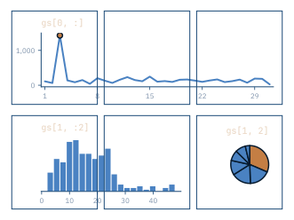

<NlIcon name="split" /> Cells, then slices

`fig.add_gridspec(2, 3)` cuts the figure into six cells. A slice picks a block:
`gs[0, :]` is the whole top row, `gs[1, :2]` two cells. One Axes fills the
block.

<NlIcon name="check" /> The shortcut

`plt.subplot_mosaic("AAA;BBC")` draws the same layout as text, and returns a
dict of Axes keyed `"A"`, `"B"`, `"C"`.

GridSpec slices the figure like an array — one Axes can span many cells

<!--
SLIDE 8 - GridSpec
On screen ~50 seconds. Concept slide, no live coding needed.

"subplots, c'est une grille où toutes les cases ont la même taille. Pour un
tableau de bord - un grand graphique en haut, deux petits en dessous - il faut
GridSpec."

Point at the six thin cells, then at the charts that cover them.
Callback to chapter twelve, slicing:
"gs crochet zéro, deux-points : toute la ligne zéro, trois cases. gs crochet
un, deux-points deux : les deux premières colonnes de la ligne un. Exactement
les tranches NumPy du chapitre douze."

PAUSE.

"Et si vous préférez dessiner la mise en page : subplot_mosaic. Trois A sur la
première ligne, B, B, C sur la seconde. Ça se lit comme un plan."

[CLICK]
"GridSpec découpe la figure comme un tableau. Un Axes peut couvrir plusieurs
cases."
-->

---
layout: default
class: nl-deck
---

# Colors & Colormaps

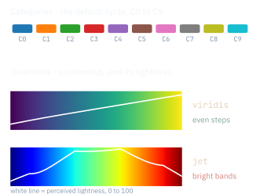

<NlIcon name="split" /> Two jobs for color

Categories get **distinct** colors: the default cycle, `C0` to `C9`. Quantities
get a **colormap**: `plt.colormaps["viridis"]` turns a number from 0 to 1 into
a color.

<ul class="mt-3" style="font-size: 1.05rem">
<li class="nl-good"><code>viridis</code>, the default: even steps, colour-blind safe</li>
<li class="nl-bad"><code>jet</code>: bright bands that look like edges in the data</li>
</ul>

Distinct colors for categories, a colormap for quantities — viridis, not jet

<!--
SLIDE 9 - Colors and colormaps
On screen ~55 seconds. Concept slide, no live coding needed.

"La couleur fait deux métiers. Distinguer des catégories : des couleurs
différentes, C0, C1, C2. C0, c'est le bleu que vous voyez sur tous les
graphiques matplotlib. Et coder une quantité : un nombre devient une couleur,
sur une échelle."

PAUSE.

Point at the white lines, the perceived lightness of each colormap:
"Sur viridis, la ligne monte régulièrement. Chaque pas de valeur donne le même
pas de luminosité. Elle reste lisible en noir et blanc, et pour un daltonien.
Sur jet, la ligne monte, plafonne, redescend. Ces bandes vives font voir des
frontières qui ne sont pas dans les données."

Time-sensitive: matplotlib.cm.get_cmap n'existe plus. On écrit
plt.colormaps de « viridis ».

[CLICK]
"Des couleurs distinctes pour les catégories, une colormap pour les
quantités. viridis, pas jet."
-->

---
layout: default
class: nl-deck
---

# Annotations & Text

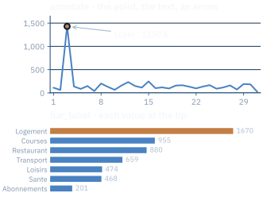

<NlIcon name="arrow" /> annotate

The text, the point it is about (`xy`), where the text sits (`xytext`), and the
arrow between them. In data coordinates: a date and euros.

<NlIcon name="box" /> text and labels

`ax.text` places free text. `bar_label` writes each bar's value at its tip.
`set_xlabel` and `set_title` name the rest.

Annotate the one point the reader must not miss

 Live in VS Code

<!--
SLIDE 10 - Annotations
On screen ~55 seconds.

Go back to the daily line from slide four, live, and add the annotation:
ax.annotate("Loyer : 1250 €",
            xy=(pd.Timestamp("2026-01-03"), 1430.12),
            xytext=(pd.Timestamp("2026-01-10"), 1200),
            arrowprops=dict(arrowstyle="->"))

"Le pic du trois janvier. On l'avait vu, sans savoir pourquoi. annotate :
le texte, le point visé, l'endroit où placer le texte, et une flèche."

"Les coordonnées sont celles des données : une date et un montant. Pas des
pixels."

PAUSE.

Then the bars, live:
bars = ax.barh(totals.index, totals.values)
ax.bar_label(bars, fmt="%.0f")
bar_label écrit la valeur au bout de chaque barre - deux cent un pour les
abonnements, mille six cent soixante-dix pour le logement.

"Le lecteur n'a plus besoin de deviner sur l'axe. Le chiffre est écrit."

[CLICK]
"Annotez le point que le lecteur ne doit pas manquer."
-->

---
layout: default
class: nl-deck
---

# 3D Plotting

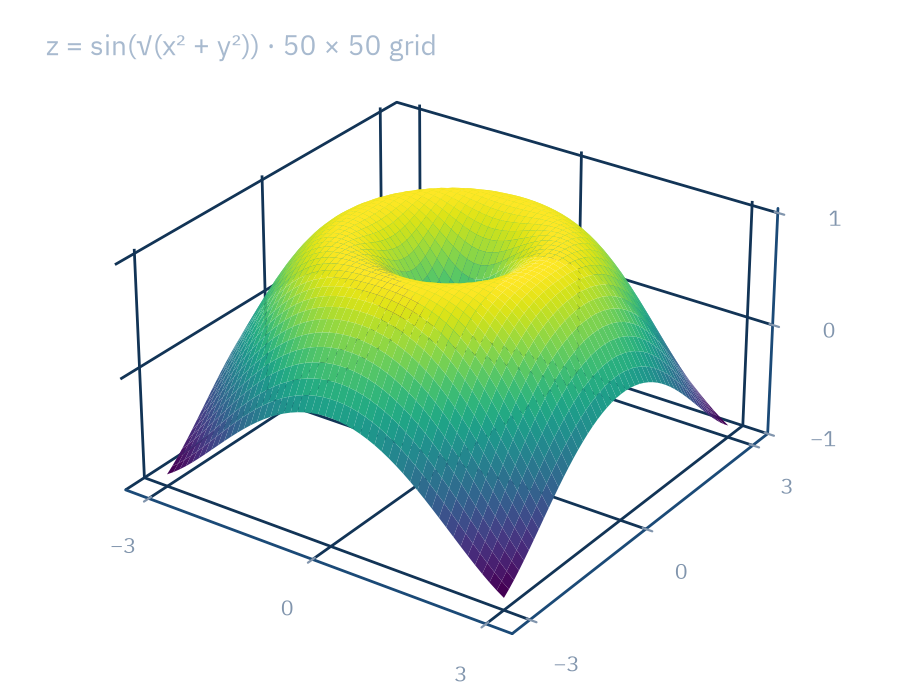

<NlIcon name="layers" /> A different Axes

`fig.add_subplot(projection="3d")` creates an `Axes3D` from
`mpl_toolkits.mplot3d`. It is registered for you: no import needed.

`np.meshgrid` from chapter 12 builds the 50 × 50 grid; `plot_surface` draws it.

<ul class="mt-3" style="font-size: 1.05rem">
<li class="nl-good">A value that depends on two variables</li>
<li class="nl-bad">3D bars for data that has two dimensions</li>
</ul>

Use 3D for a surface of two variables — never to decorate a flat chart

<!--
SLIDE 11 - 3D
On screen ~50 seconds. Concept slide, no live coding needed.

Callback to chapter twelve, meshgrid:
"meshgrid, au chapitre douze : deux grilles de cinquante sur cinquante. Pour
chaque case, un x et un y. z en est une fonction - le sinus de la distance au
centre - et plot_surface la dessine en relief."

"projection égale 3d, et l'Axes devient un Axes3D. Il vient de
mpl_toolkits, mais matplotlib l'enregistre tout seul : pas d'import."

PAUSE.

Why it matters later in the course:
"Une valeur qui dépend de deux variables, c'est exactement la surface d'erreur
qu'un modèle descend pendant son entraînement. On la reverra."

"Mais un histogramme en 3D, c'est de la décoration. La perspective cache des
barres et déforme les hauteurs."

[CLICK]
"La 3D, pour une surface à deux variables. Jamais pour décorer un graphique
plat."
-->

---
layout: default
class: nl-deck
---

# Saving Figures

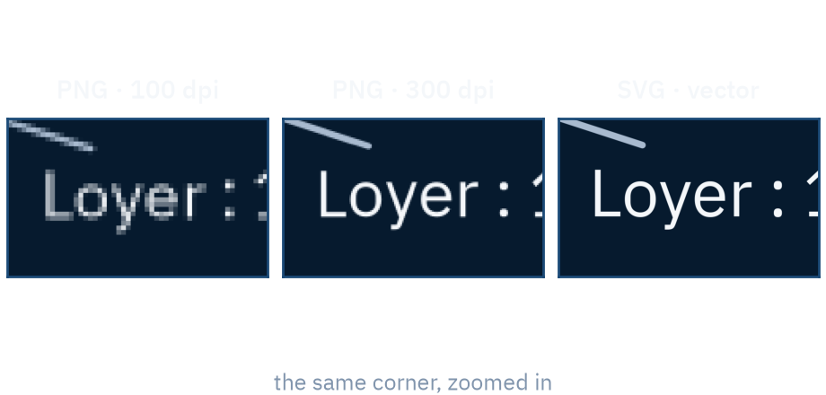

`fig.savefig("depenses.png")`: the default figure is 6.4 × 4.8 inches, so 640 ×
480 pixels. With `dpi=300`: 1920 × 1440.

<NlIcon name="download" /> Pixels or vectors

  
PNG

pixels: inches × dpi — screens, slides

  
PDF

vectors — papers, print

  
SVG

vectors as text — the web

`bbox_inches="tight"` trims the empty margins. A vector file stays sharp at
any zoom.

<code>dpi</code> only decides pixels — PDF and SVG stay sharp at any size

 Live in VS Code

<!--
SLIDE 12 - Saving
On screen ~60 seconds.

Callback to chapter six, file formats: "Un format, c'est un choix. Ici aussi."

Point at the three zooms first:
"Le même coin du même graphique, agrandi. À cent points par pouce : des
escaliers. À trois cents : beaucoup mieux. En vectoriel : net, à n'importe
quel zoom."

Then run it live and open both PNG files:
fig.savefig("depenses.png")
fig.savefig("depenses.png", dpi=300)
"Sans rien préciser : six virgule quatre pouces sur quatre virgule huit, à
cent points par pouce. Six cent quarante sur quatre cent quatre-vingts
pixels. Avec dpi égale trois cents : mille neuf cent vingt sur mille quatre
cent quarante."

PAUSE.

"PDF et SVG ne sont pas des pixels. Ce sont des instructions : trace une
ligne d'ici à là. Le dpi n'y change rien - le fichier SVG fait exactement la
même taille."

bbox_inches tight: rogne les marges blanches autour du graphique.

[CLICK]
"Le dpi ne décide que des pixels. PDF et SVG restent nets à toutes les
tailles."
-->

---
layout: default
class: nl-deck
---

# Seaborn's Four Plot Families

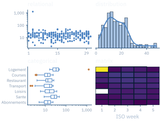

<NlIcon name="layers" /> Four families

  
relational

scatterplot, lineplot

  
distribution

histplot, kdeplot

  
categorical

barplot, boxplot

  
matrix

heatmap

Give it a DataFrame and column names; it groups and aggregates. Each call
returns a matplotlib `Axes`. `relplot`, `displot`, `catplot` return a `FacetGrid`.

seaborn draws on a matplotlib Axes — everything you know still applies

 Live in VS Code

<!--
SLIDE 13 - Seaborn families. This is the chapter's PAYOFF.
On screen ~65 seconds.

"seaborn prend un DataFrame et des noms de colonnes. Il regroupe et il
additionne lui-même : pas de groupby à écrire."

Read the four families on the figure: relationnel, distribution, catégoriel,
matriciel.

Callback to chapter thirteen: the heatmap is the pivot table, category by
week. Sept catégories, cinq semaines, une couleur par case - et la case
jaune, c'est encore le loyer.

PAUSE.

Then land the payoff planted on the Figure-Axes slide. Type it live:
ax = sns.barplot(data=df, x="montant", y="categorie",
                 estimator="sum", errorbar=None)
type(ax)              ->  <class 'matplotlib.axes._axes.Axes'>
ax.set_title("Janvier")

"Regardez ce que seaborn renvoie. Un Axes. Celui de la diapositive trois.
seaborn n'a pas inventé ses propres objets : il dessine sur un Axes
matplotlib, et il vous le rend. set_title, annotate, savefig - tout ce qu'on
vient d'apprendre s'applique. Ces quatre graphiques ont d'ailleurs les mêmes
couleurs que les autres : ce sont les réglages matplotlib de ce chapitre."

[CLICK]
"seaborn dessine sur un Axes matplotlib. Tout ce que vous savez s'applique
encore."

Time-sensitive: seaborn 0.13. errorbar égale None remplace l'ancien ci égale
None des tutoriels plus vieux.
-->

---
layout: default
class: nl-deck
---

# Seaborn Styling

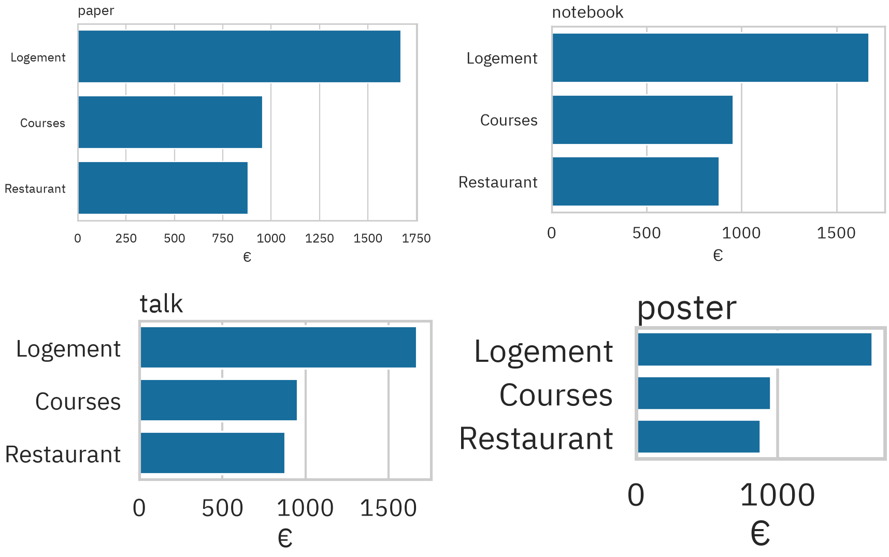

<NlIcon name="layers" /> Three knobs of <code>set_theme</code>

  
style

background and grid: darkgrid, whitegrid, ticks

  
context

font size: paper 9.6, notebook 12, talk 18, poster 24

  
palette

the colors: deep, colorblind, viridis

The defaults are `darkgrid`, `notebook` and `deep`. It changes matplotlib's
settings, so plain matplotlib follows too.

Choose the context for where the chart is seen — <code>talk</code> for a screen across the room

<!--
SLIDE 14 - Seaborn styling
On screen ~50 seconds. Concept slide, no live coding needed.

"Trois réglages. Le style : le fond et la grille. Le contexte : la taille du
texte. La palette : les couleurs."

Point at the four panels: the same chart, the same size, only the context
changes.
"Le contexte paper écrit en neuf virgule six points. poster, en vingt-quatre.
Un graphique pour une présentation ou une vidéo, c'est talk : dix-huit
points. Sinon, personne ne lit vos axes."

PAUSE.

"Et set_theme ne touche pas que seaborn. Il change les réglages de
matplotlib. Tous les graphiques suivants, même en matplotlib pur, prennent le
thème."

[CLICK]
"Choisissez le contexte selon l'endroit où le graphique sera vu. talk, pour
un écran au fond de la salle."
-->

---
layout: default
class: nl-deck
---

# Plotly Express

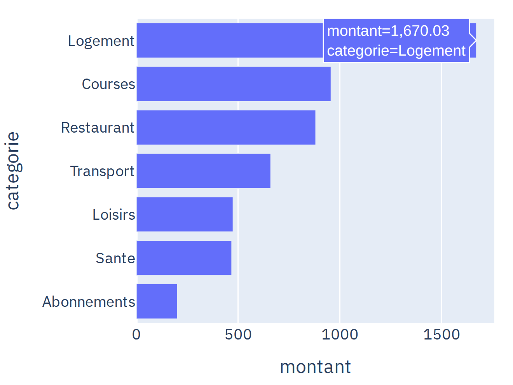

<NlIcon name="play" /> A chart you can explore

`px.bar(data, x=..., y=...)`: a DataFrame and column names, like seaborn.
Hover shows each value; a drag zooms.

<NlIcon name="split" /> Not matplotlib

No Axes here: a plotly `Figure` holds traces, the data, and a layout, the rest.

Plotly Express: an interactive chart in one line — not matplotlib

 Live in VS Code

<!--
SLIDE 15 - Plotly Express
On screen ~60 seconds.

Run the bar chart live, then hover over a bar:
fig = px.bar(totals.reset_index(), x="montant", y="categorie", orientation="h")
fig.show()
"Les mêmes totaux. Mais passez la souris : la valeur exacte apparaît. Tirez
un rectangle : on zoome. Double-clic : on revient."

Then a scatter colored by category:
px.scatter(df, x="date", y="montant", color="categorie")
Click a category in the legend to hide it. Sept catégories, sept traces.

PAUSE.

Contrast with the payoff of slide thirteen:
"Attention : ici, plus d'Axes. type de fig : une Figure plotly. Ce n'est pas
matplotlib. set_title n'existe pas. Plotly a son propre vocabulaire - on le
voit sur la diapositive suivante."

[CLICK]
"Plotly Express dessine un graphique interactif en une ligne. Et ce n'est pas
matplotlib."

Time-sensitive: plotly 7.1, qui embarque plotly.js 4.1.1.
-->

---
layout: default
class: nl-deck
---

# `update_layout` & `update_traces`

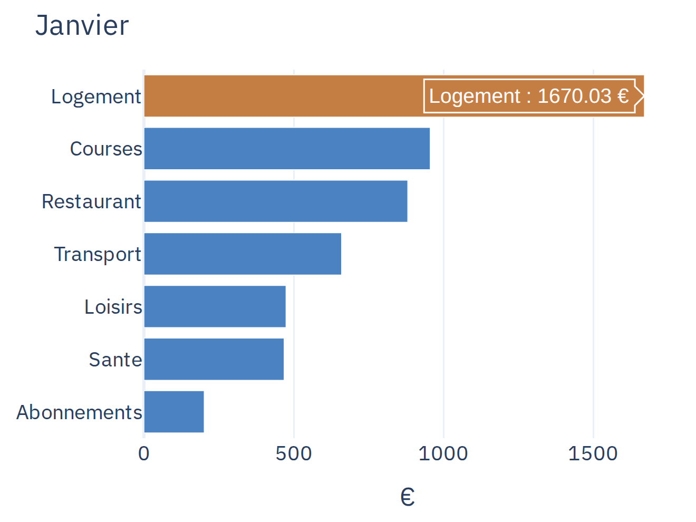

<NlIcon name="layers" /> Two halves of a Figure

  
layout

title, axes, legend, template, size

  
traces

the data: colors, hover text, markers

  
selector

update only the traces that match

Each call returns the figure, so they chain. `hovertemplate` writes the hover:
`%{x:.2f}` is chapter 02's format spec.

<code>update_layout</code> styles the frame; <code>update_traces</code> styles the data

<!--
SLIDE 16 - Plotly customization
On screen ~55 seconds. Concept slide, no live coding needed.

Compare with the previous slide, same chart:
"Une Figure plotly, c'est deux moitiés. Le layout : tout ce qui entoure les
données - le titre, les axes, la légende, le thème. Ici, un titre, et le
thème plotly_white. Et les traces : les données elles-mêmes. Ici, une couleur
par barre, et l'infobulle."

The calls behind it, for reference:
fig.update_layout(title_text="Janvier", template="plotly_white")
fig.update_traces(marker_color=colors, hovertemplate="%{y} : %{x:.2f} €")
marker_color takes one colour, like "teal", or one colour per bar.

"update_layout pour le cadre. update_traces pour les données. Et chacune
renvoie la figure, donc on peut les enchaîner."

PAUSE.

Callback to chapter two, the format spec:
"Le hovertemplate, c'est le texte de l'infobulle. Deux-points point deux f :
deux décimales. Le même format que dans les f-strings du chapitre deux."

selector in one sentence: sur un graphique avec plusieurs traces, selector
choisit lesquelles modifier.

[CLICK]
"update_layout habille le cadre. update_traces habille les données."
-->

---
layout: default
class: nl-deck
---

# Exporting Interactive HTML

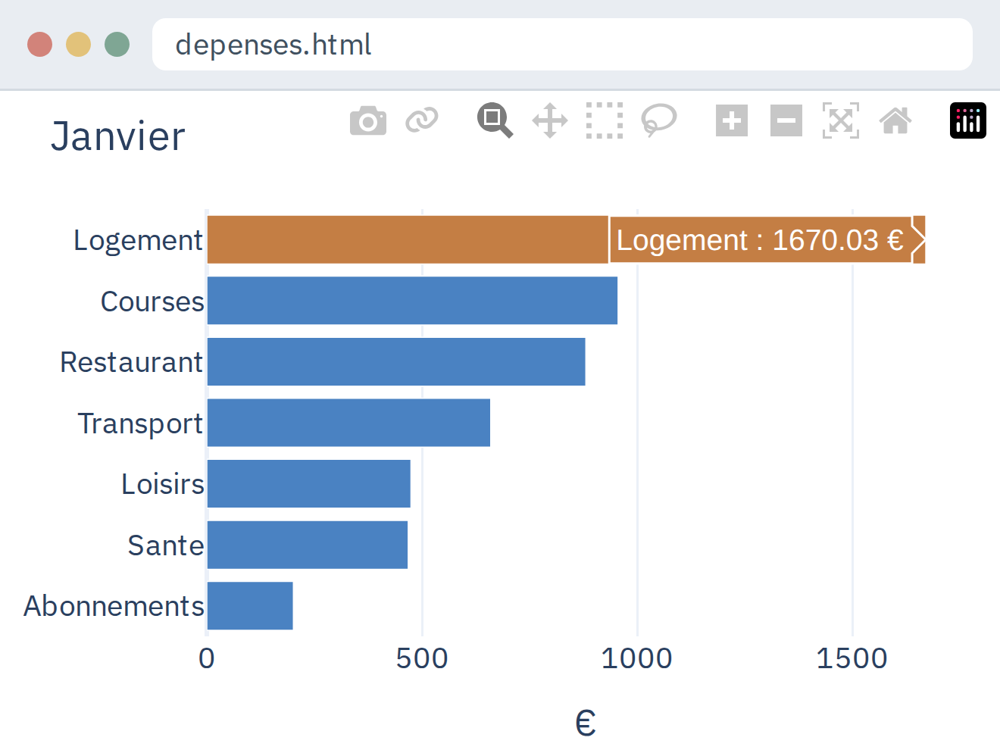

<NlIcon name="check" /> Hover and zoom still work

`fig.write_html(...)` writes one file for any browser. No Python needed.

<ul class="mt-3" style="font-size: 1.05rem">
<li class="nl-good">Full file, ~4.8 MB: works offline</li>
<li class="nl-good"><code>include_plotlyjs="cdn"</code>, ~8 KB: needs a connection</li>
<li class="nl-bad"><code>write_image</code> fails until kaleido is installed</li>
</ul>

<code>write_html</code> shares an interactive chart — no Python needed

 Live in VS Code

<!--
SLIDE 17 - Exporting HTML
On screen ~55 seconds.

Run both calls live and show the two file sizes:
fig.write_html("depenses.html")
fig.write_html("depenses.html", include_plotlyjs="cdn")
"Le premier fichier fait presque cinq mégaoctets. Toute la bibliothèque
plotly.js est dedans. Il marche sans connexion. Le second fait huit
kilooctets : il charge plotly.js depuis Internet."

Double-click the file in the explorer, and hover a bar in the browser, as on
the slide:
"Pas de Python. Pas de Jupyter. Un navigateur, et l'infobulle marche
toujours. C'est ça qu'on envoie à quelqu'un."

PAUSE.

For a still image: fig.write_image("depenses.png"). Il lui faut le paquet
kaleido, et kaleido pilote un Chrome installé sur la machine.

[CLICK]
"write_html donne à n'importe qui un graphique interactif. Sans Python pour
l'ouvrir."

Time-sensitive: depuis kaleido 1.0, l'export d'image a besoin de Chrome.
Les tailles dépendent de la version de plotly.js embarquée.
-->

---
layout: default
class: nl-deck
---

# Visualization Pitfalls

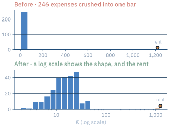

<NlIcon name="cross" /> Three silent mistakes

<ul class="mt-2">
<li class="nl-bad"><code>plt.title</code> after <code>subplots</code>: only the last Axes</li>
<li class="nl-bad"><code>plt.savefig</code> after <code>plt.show()</code>: a blank file</li>
<li class="nl-bad">One outlier sets the axis for everyone</li>
</ul>

<NlIcon name="check" /> The fixes

<ul class="mt-2">
<li class="nl-good"><code>ax.set_title</code> on the Axes you mean</li>
<li class="nl-good">Save, then show, then <code>plt.close(fig)</code></li>
<li class="nl-good">Filter, or a log scale — and say so</li>
</ul>

A chart can be wrong without an error — look at it before you share it

<!--
SLIDE 18 - Pitfalls
On screen ~60 seconds. Close the chapter on the mistakes, not a summary.

Read the left list, then the fixes, pair by pair. Ten seconds each.

"plt.title après subplots : seul le dernier graphique a un titre. plt.savefig
après show : la fenêtre a fermé la figure, et vous enregistrez une image
vide. Et un seul loyer qui écrase deux cent quarante-six dépenses dans une
barre - le graphique du haut."

PAUSE.

Point at the bottom chart:
"Même données, échelle logarithmique. La forme apparaît, et le loyer reste
visible, tout à droite. Mais dites-le sur l'axe : un lecteur qui ne voit pas
« log » lit des distances fausses."

On closing figures: "Dans une boucle qui génère des graphiques, chaque Figure
reste en mémoire. Au-delà de vingt, matplotlib vous prévient. plt.close après
chaque savefig."

[CLICK]
"Un graphique peut être faux sans aucune erreur. Regardez-le avant de le
partager."

Callback to chapter thirteen: même famille que les pièges pandas. Le code
tourne, l'image s'affiche, et elle ment.
-->

---
layout: end
class: nl-deck
---

# Thanks for watching

The full code is in the description

Next video · Tuesday
<strong>CHAPTER 15 — WORKING WITH APIS</strong>

<!--
SLIDE 19 - Closing card
On screen ~12 seconds.

One sentence of chapter summary before the sign-off:
"Une Figure, des Axes, et le bon graphique pour la bonne question."

Say the next chapter's topic out loud while this is up: chapitre quinze, les
API - des données qui ne viennent plus d'un fichier, mais d'un serveur.
Then: "À mardi." Hold two beats of silence before you stop recording.
-->
